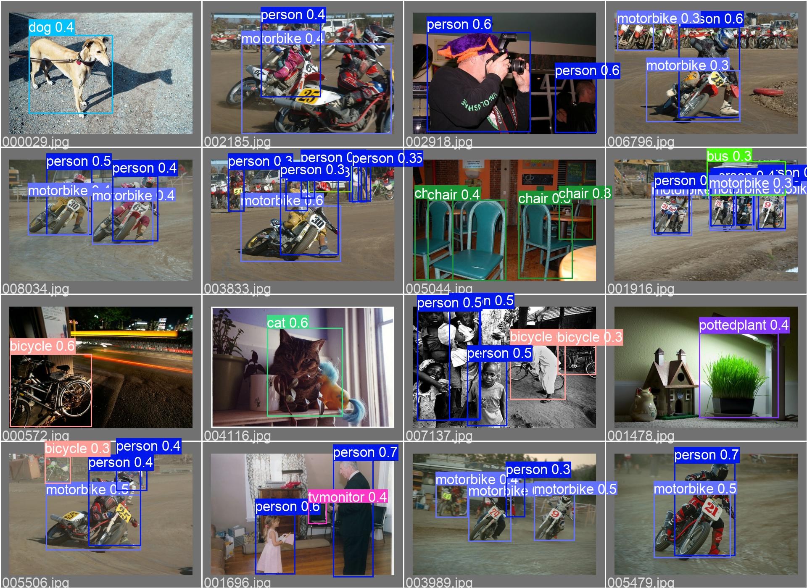

# YOLOV5-SWIFT

This repository is based on [ultralytics/yolov5](https://github.com/ultralytics/yolov5). Seeed has modified it to make it more suitable for AIoT hardware devices launched by Seeed.




## Model test results on the coco dataset

  Model | Input_size|Flops| Params | Size（M） |Map@0.5|Map@.5:0.95
 :-----:|:-----:|:----------:|:----:|:----:|:----:|:----:|
 yolov5n6-xiao| 192×192| 0.9G|0.7M|1.23| 0.28|0.15

## Test speed in different situations

Equipment|Computing backend|Input|specification|time(ms)
:---:|:---:|:---:|:---:|:---:|
Inter|i5-9400@2.90GHz|192×192|pt|15
Himax6537|400MHz|192×192|tflite|700


## <div>Quick start  <a href="https://colab.research.google.com/github/Seeed-Studio/yolov5-swift/blob/master/tutorial.ipynb" target="_parent"></a> </div> 

<details open>
<summary>Install</summary>

[**Python>=3.7.0**](https://www.python.org/) is required with all
[requirements.txt](https://github.com/Seeed-Studio/yolov5-swift/blob/master/requirements.txt) installed including
[**PyTorch>=1.7**](https://pytorch.org/get-started/locally/):

<!-- $ sudo apt update && apt install -y libgl1-mesa-glx libsm6 libxext6 libxrender-dev -->

```bash
$ git clone https://github.com/Seeed-Studio/yolov5-swift
$ cd YOLOv5-swift
$ pip install -r requirements.txt
```

</details>

<details>
<summary>Inference with detect.py</summary>

`detect.py` runs inference on a variety of sources, downloading models automatically from
the [YOLOv5n6-xiao](https://github.com/ultralytics/yolov5/releases) and saving results to `runs/detect`.

```bash
$ python detect.py --source 0  # webcam
                            file.jpg  # image 
                            file.mp4  # video
                            path/  # directory
                            path/*.jpg  # glob
                            'https://youtu.be/NUsoVlDFqZg'  # YouTube
                            'rtsp://example.com/media.mp4'  # RTSP, RTMP, HTTP stream
```

</details>

<details open>
<summary>Training</summary>

```bash
$ python train.py --data coco.yaml --cfg yolov5n6-xiao.yaml --weights yolov5n6-xiao.pt --batch-size 128    
```

</details>  
<details open>
<summary>Export TFlite</summary>

The trained pt format model can be exported to the int8 type tflite model by the following command

```bash
$ python export.py --data coco.yaml --cfg yolov5n6-xiao.yaml --weights yolov5n6-xiao.pt --imgsz 192 --int8   
```

</details>  

</details>  
<details open>
<summary>Export UF2</summary>

[UF2](https://github.com/microsoft/uf2) is a file format, developed by Microsoft. Seeed uses this format to convert .tflite to .uf2, allowing tflite files to be stored on the AIoT devices launched by Seeed.

At present, Seeed stipulates to run and store 4 tflite files, each file is less than 1M, and its corresponding offset and index are listed below.

 offset|index
:---:|:---:|
|0x30000000|1|
|0x30100000|2|
|0x30200000|3|
|0x30300000|4|

You can simply convert tflite to uf2 with the following command.

```bash
$ python uf2conv.py -e 4 -f GROVEAI -b 0x30000000 -c xxx.tflite -o xxx.uf2
```

</details>  


## References
[1] [Official YOLOV5 repository](https://github.com/ultralytics/yolov5/)

[2] [Official UF2 repository](https://github.com/microsoft/uf2)
